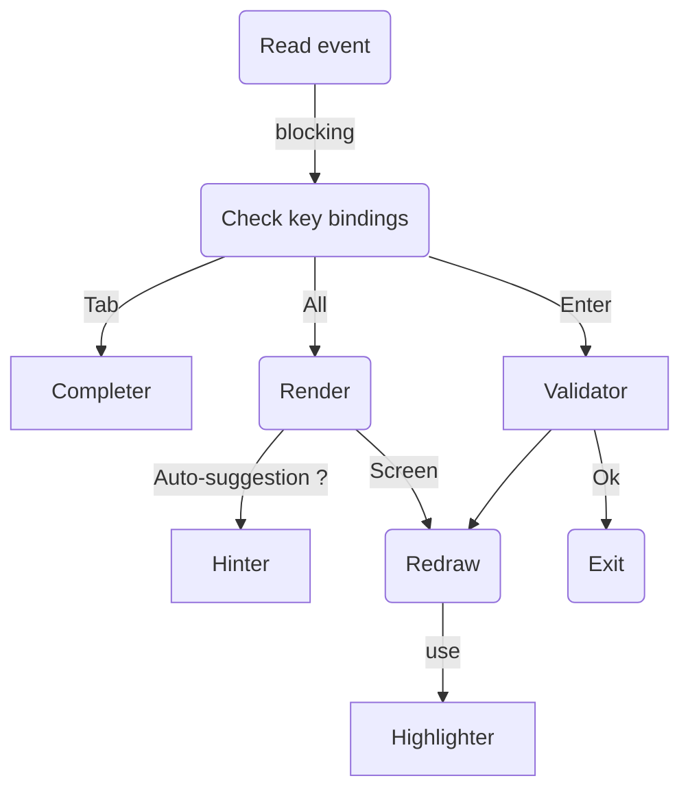

# REPL

```mermaid
flowchart TD
    I(Read event) -->|blocking| B(Check key bindings)
    B -->|Tab| C[Completer]
    B -->|Enter| V[Validator]
    B -->|All| R(Render)
    R -->|Auto-suggestion ?| S[Hinter]
    R -->|Screen| P(Redraw)
    P -->|use| H[Highlighter]
    V --> P
    V -->|Ok| E(Exit)
```